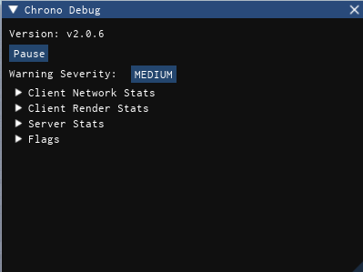
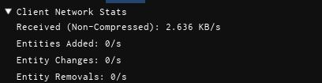
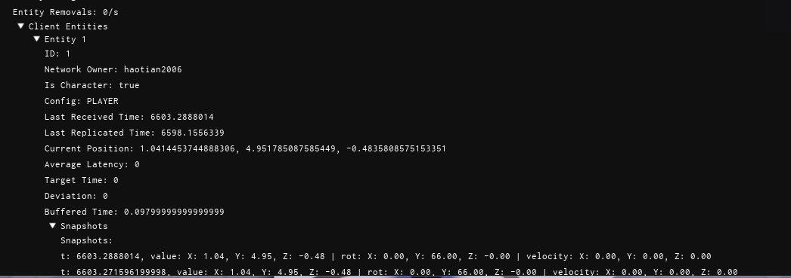
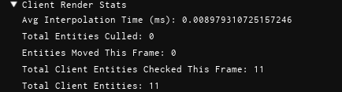
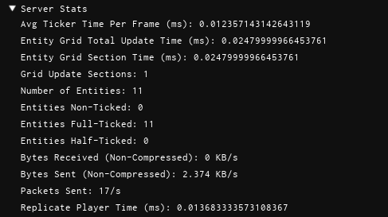
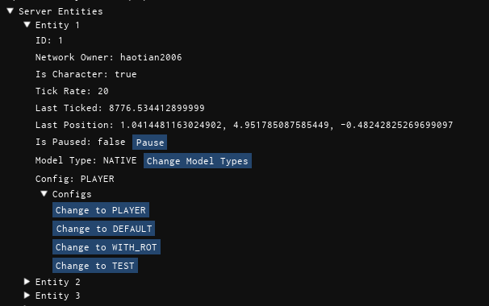
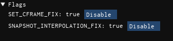

# Using the debugger

Chrono includes a client-side debugger script for realtime snapshots, latency data, and live settings.

## Setup

1. Copy `test/Debugger/init.client.luau` into a client-side script in your game. The source file is available here: [test/Debugger/init.client.luau](https://github.com/Parihsz/Chrono/blob/master/test/Debugger/init.client.luau)
2. Install Iris, either through your package manager or by downloading the latest RBXM from [SirMallard/Iris](https://github.com/SirMallard/Iris/releases/latest).
3. Update the debugger script paths as needed:

```lua
local PAUSE_KEY = Enum.KeyCode.E
local OPEN_CLOSE_KEY = Enum.KeyCode.F3
local CHRONO = ReplicatedStorage.Packages.chrono -- Replace with your Chrono path
local IRIS = ReplicatedStorage.DevPackages.iris -- Replace with your Iris path
```

## Permissions

After setup, you need to give yourself or other developers permission to view the debugger. 

You can either add specific UserIds into `Stats.REPLICATE_PERMISSIONS`
```lua
Stats.REPLICATE_PERMISSIONS = {
   [123456789] = true, -- Replace with your UserId
}
```

Or you can add user at run time via `Stats.ReplicateStatsForPlayer(player: Player|number)`
```lua
--// This script gives permission to all players.
local Players = game:GetService("Players")
Players.PlayerAdded:Connect(function(player)
   Stats.ReplicateStatsForPlayer(player) -- Or Stats.ReplicateStatsForPlayer(player.UserId)
end)
```
!!! info
    Make sure this is done on the server side not the client side.

## Using the Debugger

!!! warning
    When using the debugger it will cause a significant increase in network usage for the client that has the debugger opened, this is due to server stats being sent every frame. This usage will return to normal when the debugger is closed.
To open the debugger, press F3 (or your chosen `OPEN_CLOSE_KEY`) in game. 
You can pause the debugger with the `PAUSE_KEY` (default E) to inspect the current state.



The first three section displays:

- The version number Chrono is currently on.
- Pause/Unpause the debugger
- Cycle through different warning levels, Updates globally

## Client Network Stats


This section shows client network replication metrics:

- Average uncompressed kilobytes received per second for entity replication.
- New entities registered per second.
- Entity changes processed per second.
- Entity removals processed per second.

### Client Entities



This section lists all entities currently registered on the client. Expanding an entity reveals its details:

- Entity ID
- Network owner
- Whether the entity is a player character
- Last time the entity was replicated to the client
- Last time the client replicated the entity to the server (client-owned entities only)
- Current position
- Average latency
- Target time
- Deviation
- Buffered time
- Snapshot history:
    - Timestamp
    - Position
    - Rotation
    - Velocity

## Client Render Stats


This section shows render and interpolation statistics for the client:

- Average time spent interpolating entities
- Number of entities culled this frame
- Number of entities whose part CFrames were updated this frame
- Total entities checked for interpolation this frame
- Total entities registered on the client

## Server Stats


This section shows server-side replication metrics:

- Average time taken for the server ticker to process entities
- Total time to update the entity grid
- Average time per grid section update [(more info)](../getting-started/configurations.md#grid-update-configurations)
- Number of grid sections updated during the last cycle
- Total entities registered on the server
- Number of entities not being ticked
- Number of entities being fully ticked
- Number of entities being partially ticked
- Uncompressed kilobytes per second received from clients for entity replication
- Uncompressed kilobytes per second sent to clients for entity replication
- Average packets sent per second for entity replication
- Average entity replication time for players

### Server Entities

 

This section lists all entities currently registered on the server. Expanding an entity reveals its details:

- Entity ID
- Network owner
- Whether the entity is a player character
- Entity Tick rate
- Last time the entity was ticked
- Current position
- If the entity is paused, click the button to pause/unpause the entity. Pausing will pause the entity on the server and stop replicating updates to clients, defaulting to native roblox behavior.
- The current model type of the entity, either `CUSTOM`, `NATIVE` or `NATIVE_WITH_LOCK`. If the entity is using either `NATIVE` or `NATIVE_WITH_LOCK`, a button will allow you to switch between the two. 
- What entity config is the entity is using, a list of configs will be accessible below that allows you to switch to any config that the client has access to. 

## Flags

 

Flags are just values that enable features or behaviors. These are mainly used for debugging and testing purposes and can be ignored. Setting a flag will update the value on the server and replicate it to all clients.