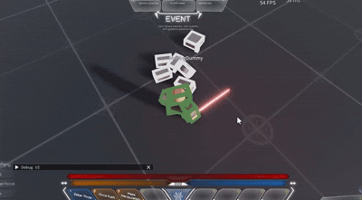

# Ragdolls
Ragdolls has been a pain point for many of us, especially when implementing custom character replication.




## How we implement ragdolls
To implement ragdolls we have a dual skeleton approach where:

* Calculation skeleton does the physics simulation
* Visual skeleton mirrors the physics skeleton's cframes for rendering

## Ragdoll System
Grab the ragdoll script and rigtypes module [here](https://gist.github.com/Parihsz/4eaf5f5d91cd084a3c06e6b1bb088c08). Note that this was made for R6 but the same concept applies for R15.

## Set up collision groups
Ragdoll parts need their own collision rules so they don't collide with active combatants but DO collide with the world and each other.
```lua
local PhysicsService = game:GetService("PhysicsService")

PhysicsService:RegisterCollisionGroup("Combatants")
PhysicsService:RegisterCollisionGroup("Combatants2")
PhysicsService:RegisterCollisionGroup("Ragdoll")

PhysicsService:CollisionGroupSetCollidable("Combatants2", "Combatants", false)
PhysicsService:CollisionGroupSetCollidable("Combatants2", "Combatants2", false)

PhysicsService:CollisionGroupSetCollidable("Ragdoll", "Default", true)
PhysicsService:CollisionGroupSetCollidable("Ragdoll", "Combatants", false)
PhysicsService:CollisionGroupSetCollidable("Ragdoll", "Combatants2", false)
PhysicsService:CollisionGroupSetCollidable("Ragdoll", "Ragdoll", true)

Players.PlayerAdded:Connect(function(player)
    player.CharacterAdded:Connect(function(character)
        for _, part in character:GetDescendants() do
            if part:IsA("BasePart") then
                part.CollisionGroup = "Combatants"
            end
        end
    end)
end)
```

### Configure Chrono for ragdolls
If you're using R6 rigs, you need to handle the PrimaryPart issue. There are only really 2 ways to handle this. If you don't depend on primarypart being the Head, I STRONGLY recommend just setting it to the humanoidrootpart. This avoids a whole host of bugs and enables further optimizations. Note that this needs to be done immediately on characteradded or it would not be processed properly by chrono. 
```lua
character.PrimaryPart = character:WaitForChild("HumanoidRootPart")
```
Some people might want to send full rotation when the player is ragdolled although that isn't necessary a lot of the times. You can do this via a seperate configuration profile. 
```lua
local Config = require(chrono.Shared.Config)

Config.RegisterEntityType("PLAYER_RAGDOLL", {
    TICK_RATE = 1 / 20,
    FULL_ROTATION = true,
    MODEL_REPLICATION_MODE = "NATIVE",
})
```
Then swap entity types when ragdolling:
```lua
Chrono.Entity.SetEntityType(entity, "PLAYER_RAGDOLL")
Ragdoll.SetRagdollEnabled(character)

--after ragdoll: 
Ragdoll.SetRagdollDisabled(character)
Chrono.Entity.SetEntityType(entity, "PLAYER")
```

If you depend on the primary part being the Head that is still fine, but you will need to slightly modify the Ragdoll script to create a 2nd set of skeleton. This is hacky but if you are depending on head being a primarypart thats arguably even more hacky. 
```lua

local function ToggleLocalTransparency(model: Model, transparency)
	for i, v in model:QueryDescendants("BasePart") do
		v = v :: BasePart
		if not v:HasTag("RAG_DOLL_COPY") then
			v.LocalTransparencyModifier = transparency
		end
	end
end

-- Activating ragdoll on an arbitrary model with a Humanoid:
local function EnableRagdoll(model: Model)
	local isSelfRagdoll = RunService:IsClient() and model == Players.LocalPlayer.Character

	local original = model
	if not isSelfRagdoll then
		ToggleLocalTransparency(model, 1)
		
		model.Archivable = true
		model = model:Clone()
		model:RemoveTag(SHOULD_RAGDOLL_TAG)
		model.Archivable = false
		model.Name = MODEL_COPY
		model.Parent = original

		for _, limb in model:QueryDescendants("BasePart") do
			limb = limb :: BasePart
			limb:AddTag("RAG_DOLL_COPY")
		end

		task.spawn(function()
			local function GetPart(model)
				if model:FindFirstChild("HumanoidRootPart") then
					return model:FindFirstChild("HumanoidRootPart")
				elseif model.PrimaryPart then
					return model.PrimaryPart
				end
				return Instance.new("Part")
			end

			while model.Parent ~= nil do
				GetPart(model).CFrame = GetPart(original).CFrame
				RunService.Heartbeat:Wait()
			end
		end)
	end

	... rest of the ragdoll script 
end
```